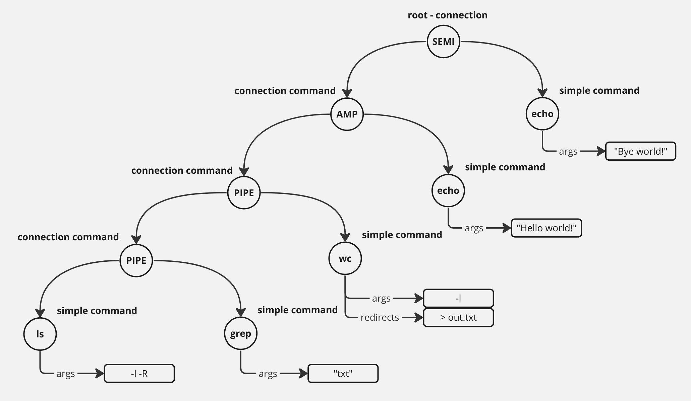
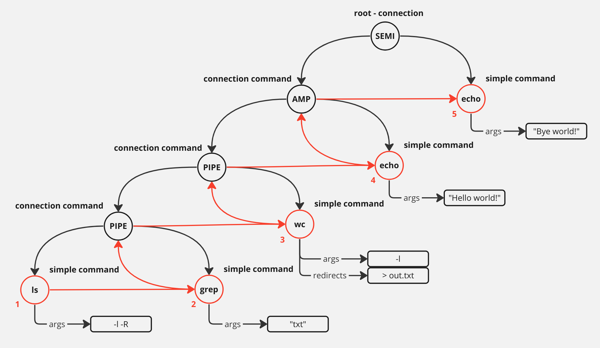

# Lab work 6: myshell 2 - a custom shell implementation
Authors (team): 
- [Yurii Kharabara](https://github.com/YuriiKharabara)
- [Andrii Yaroshevych](https://github.com/andylvua)
- [Pavlo Kryven](https://github.com/codefloww)

## Description
This project is a custom command-line interpreter that provides a user interface for executing commands. 
The shell is the primary way of interacting with the operating system, 
allowing users to execute commands and manage files and directories. 

## Documentation

The documentation for the whole project is available here: 
#### https://andylvua.github.io/myshell-docs/

This also includes documentation for external utilities shipped with the shell. Fell free to read it, as 
it may be useful for understanding the project and it's components.

## Compilation and running

### Requirements

The project is build using C++20 standard. 

- [CMake](https://cmake.org/) (version 3.15 or higher)
- [GCC](https://gcc.gnu.org/) (version 12.3.0 or higher) or [Clang](https://clang.llvm.org/) (version 16.0.6 or higher)

> **Note**
> 
> Tested on GCC `13.2.1` and Clang `17.0.3`.

Besides, it heavily relies on the following libraries:
- [Boost](https://www.boost.org/) (version 1.71.0 or higher)
- [Readline](https://tiswww.case.edu/php/chet/readline/rltop.html) (version 8.0 or higher)

> **Note**
> 
> For installation instructions, please refer to official documentation.


### Compilation

1. Use the provided `CMakeLists.txt` to compile the project:
    ```bash
      cmake -S . -B build -DCMAKE_BUILD_TYPE=Release && cmake --build build
    ```
2. Run the compiled executable:
    ```bash
    ./build/myshell
    ```

> **Note**
> 
> Alternatively, you can use the provided `compile.sh` script to compile and run the project:
> ```bash
> ./compile.sh -O
> ```

## Usage

The usage of the shell is similar to that of other shells, such as `bash` or `zsh`. 
If you are familiar with these shells, you should have no trouble using `myshell`.

### Adding External Commands

The external commands are compiled separately and can be invoked directly from the shell, much like built-in commands.
They are recognized automatically by the build system. All external commands are placed in the `{CMAKE_BINARY_DIR}/msh/bin/external` directory that is added to the `PATH` environment variable on startup.
This ensures that `myshell` can always find them.

All processing is done by [ExternalPrograms.cmake](./cmake/ExternalPrograms.cmake) script.

For exact instructions on how to add external commands, please refer to the [README.md](./src/external/README.md) file in the `external` directory.

### History

`myshell` supports command history. Its path is predefined by the build system and is set to `{CMAKE_BINARY_DIR}/msh/.msh_history`.
This ensures that the history file is placed in the build directory and it will not be in vain to clog the examiner's computer.
Also, this allows us to use the persistent history between different runs of the shell.

If you want to change the path to the history file, consider changing the `MSH_HISTORY_PATH` variable in the `CMakeLists.txt` file to your desired path.

## Updates from myshell 1

All mistakes and bugs from `myshell 1` were fixed. The shell is now fully functional and supports all features from the main task.

Besides, here is a detailed description of the new features that are implemented in `myshell 2`:

### Redirections

`myshell` supports the following redirections:
- Redirecting output:<br>`n>word` - Open file `word` for writing on file descriptor `n`. If `n` is omitted, it defaults to 1.

- Appending output:<br>`n>>word` - Open file `word` for appending on file descriptor `n`. If `n` is omitted, it defaults to 1.

- Redirecting input:<br>`n<word` - Open file `word` for reading on file descriptor `n`. If `n` is omitted, it defaults to 0.

- Redirecting output and error:<br>`&>word` - Redirect both standard output and standard error to file `word`. Equivalent to `>word 2>&1` and `>&word`.

- Appending output and error:<br>`&>>word` - Append both standard output and standard error to file `word`. Semantically equivalent to `>>word 2>&1`.

- Duplicating file descriptors:

  * `n<&word` - The file descriptor `n` is made to be a copy of the descriptor specified by `word`. If `word` doesn't specify a descriptor, the redirection is ill-formed due to ambiguity. If `n` is not specified, the standard input (file descriptor 0) is used. If descriptor specified by `word` is not correct, the redirection error occurs. <br>
  * `n>&word` - Used for duplicating output file descriptors. If `n` is not specified, the standard output (file descriptor 1) is used. If `word` doesn't specify a descriptor, it is interpreted as a filename to open. If the file descriptor specified by `word` is not correct, the redirection error occurs. If `n` is omitted, and `word` does not specify a file descriptor, the redirect is equivalent to `&>word`.

### Connections - pipelines, background, and sequential execution, logical operators

`myshell` supports the following connections:

- Sequential execution:
  ```bash
  command1; command2; command3
  ```
  
  The commands are executed sequentially, one after another. The shell waits for each command to finish before executing the next one.

  The processing is done in left-to-right manner, i.e. the following command:
  ```bash
  var="world"; echo "Hello, $var"
  ```
  
  is equivalent to:
  ```bash
  var="world"
  echo "Hello, $var"
  ```
  
  and will print `Hello, world` to the standard output.
<br><br>
- Pipelines:
  ```bash
  command1 | command2 | command3
  ```
  
  The commands are executed in a pipeline. The standard output of each command is connected via a pipe to the standard input of the next command.
  Connection is performed before any redirections specified by command.
  <br><br>
  The shell waits for all commands to finish. However, the commands are executed asynchronously, and order of execution is undefined.<br>
  <br>
  The exit code (`msh_errno`) after the pipeline is exacly the exit code of the last command in the pipeline.
  
  > **Note**
  >
  > Piping both stdout and stderr:
  >
  > To achieve this, you can use the `|&` control operator. It is equivalent to `2>&1 |`.
  > ```bash
  > command1 |& command2
  > ```
  > 
  > Will pipe both stdout and stderr of `command1` to `command2`. This implicit redirection is performed after any explicit redirections of `command1`.

- Background execution:
  ```bash
  command1 & command2 & command3 &
  ```
  
  The commands that are terminated with `&` are executed asynchronously in the background. The shell doesn't wait for them to finish and immediately returns control to the user. 
  <br><br>
  The exit code (`msh_errno`) after the background execution is always 0.
  <br><br>
  You can see the list of background processes using the `mjobs` built-in command. Find more about job control in the [Job Control](#job-control) section.

- Logical operators:
  ```bash
    command1 && command2
    command1 || command2
    ```
  
  * `&&` - The shell executes the command `command2` if and only if the command `command1` returns an exit status of zero.
  * `||` - The shell executes the command `command2` if and only if the command `command1` returns a non-zero exit status.

### Command Substitution

`myshell` supports command substitution. It allows the output of a command to be used in place of command itself:

```bash
echo "The current working directory is $(pwd)"
```

The command substitution is performed by enclosing the command in backticks or `$()`. Execution of the command is performed in a subshell.

Any trailing newlines are removed from the output of the command substitution. Output of the command substitution is subject to word splitting and filename expansion.
Embedded newlines are not deleted, but they may be removed during word splitting if `IFS` contains the newline character.

To prevent word splitting or filename expansion, enclose the command substitution in double quotation marks:
```bash
echo "$(ls -l)"
```

Command substitutions may be nested:
```bash
echo $(mexport var="world!"; echo $(echo "Hello, $var" | cat))
```

will print `Hello, world!` to the standard output.

### Job Control

`myshell` supports the simplest job control for illustrative purposes. It allows users to manage background processes.

When background processes are executed, the shell prints the following message:
```text
[#] PROCESS_ID
```

where `#` is the job number and `PROCESS_ID` is the process ID of the background process.

When processes are terminated, the shell prints the following message on the next user input:
```text
[#] Done        COMMAND
```

Also, to list all background processes that are currently running or just finished their execution, you can use the `mjobs` built-in command:
```bash
mjobs
```

Output example:
```text
$ sleep 10 & sleep 5 &
[1] 83205
[2] 83206

$ mjobs
[1] Running     sleep 10 
[2] Running     sleep 5 

# Wait for at least 10 seconds

$ mjobs
[1] Done     sleep 10 
[2] Done     sleep 5 
```

> **Note**
> 
> The other important role of the job control is to handle `SIGCHLD` signals. This helps to avoid zombie processes
> in the middle of the pipeline during execution. Without this, the shell will wait for the process to finish
> only after the whole pipeline is executed. This is not crucial for the shell, nevertheless, it is not kind of
> expected behavior.

Job control is implemented in the [src/internal/msh_jobs.cpp](src/internal/msh_jobs.cpp) file and planned to be improved in the future to support more advanced features such as process groups and job control signals.

## Implementation details

### Tokens
Tokens are the basic building blocks of `myshell`. All internal operations are performed on tokens.
Tokens can have different flags, which determine how they are processed by the shell.

You can find the token and token types definitions in the [msh_token.h](inc/types/msh_token.h) file.
Flags are defined in the [msh_internal.cpp](src/internal/msh_internal.cpp) file.

### Lexer/Tokenizer
The lexer/tokenizer is a crucial component of `myshell`. Basically, it is a simple state machine that tokenizes the user input.

It takes the raw input string from the user and breaks it down into individual tokens. 
These tokens can represent commands, words, variable definitions, shell metacharacters etc. 
By tokenizing the input, `myshell` can understand and act upon user commands effectively.

The lexer/tokenizer is implemented in the [msh_parser.cpp](src/internal/msh_parser.cpp) file.

### Pipeline Overview

`myshell` pipeline is implemented using the following components:

**Setup**

When `myshell` starts, it initializes essential configurations:
- Initializes internal environment variables from its own environment.
- Loads command history from the history file. Its path is determined by the build system.
- Initializes the job control, e.g. sets up signal handlers, etc.
- Sets up other necessary configurations.

**Main Loop**

`myshell` enters its main loop, continuously awaiting user input. 
Within this loop, the following operations are performed:

- Read User Input <br><br>
The shell waits for the user to enter a command.
<br><br>
- Tokenization and syntax checking <br><br>
The input is tokenized using a lexer/tokenizer, breaking the user input into individual tokens representing commands, arguments, or special symbols. If the input is invalid, the shell prints an error message and stops the execution of the current input.
<br><br>
- Building Command Tree <br><br>
The shell builds a command tree from the tokens. The command tree is a tree-like structure that represents the pipeline with specific types of connections. This process is not trivial, so it's described in more detail in the [Command Tree](#command-tree) section.
<br><br>
The alias expansion is performed during this step, i.e. on the whole command line.
- Command Execution <br><br>
The shell executes the command tree. Before execution of each simple command, the tokens processing is performed. This process is described in more detail in the [Command Execution](#command-execution) section.


**Cleanup**

When the user exits the shell, it saves the command history to the history file and performs other necessary cleanup operations.

### Command Tree

This section describes the process of building the command tree in more detail.

Consider the following command:
```bash
ls -l -R | grep "txt" | wc -l > out.txt & echo "Hello, world!"; echo "Bye, world!"
```

The command tree for this command is shown below:



The root node of the tree is always a `command`. `command` can either hold a pointer to a `simple_command` or a `connection_command`.
`connection_command` represents a connection between two commands. It can be either a pipeline, a sequential execution, a background execution, or a logical operator.
It holds a type of connection and objects of type `command` that are connected by this connection - `rhs` and `lhs`.

Note that leaf nodes of the tree are always `simple_command`s. `simple_command` is the execution unit of the shell. It holds the command arguments, redirections, and other information necessary for execution.

The command tree is built iteratively by the `split_commands()` function located in the [src/internal/msh_utils.cpp](src/internal/msh_utils.cpp) file. You can read more about it and other shell functions in the documentation provided above.

### Command Execution

The execution starts from the root node of the command tree.

Each type of command has its own execution function that implements the corresponding logic. Feel free to read the documentation for `msh_command.h` to learn more about them.

As stated above, the elementary execution unit of the shell is a `simple_command`. They are executed by the `msh_exec_simple()` function located in the [src/internal/msh_exec.cpp](src/internal/msh_exec.cpp) file.
The execution of each node is performed recursively in a post-order manner. For better understanding, here is an illustration of the execution order for the command tree shown above:



Before executing a simple command, if it's located within a connection command, the execution function of the latter is responsible for performing the necessary operations, such as setting up pipes, proper execution flags, etc.

Execution of each simple command is performed in the following steps:
- Tokens Processing <br>
This step involves several sub-steps:
    - _Variable Expansion_: All variables are expanded into their corresponding values.
    - _Command Substitution_: All command substitutions are performed.
    - _Setting Internal Variables_: The shell processes variable declarations and sets the corresponding internal variables.
    - _Wildcard Expansion_: Wildcard characters are expanded into their corresponding file names.
    - _Tokens Merging_: The shell merges adjacent tokens into a single token if necessary.
  
> **Note**
> 
> The result of variable expansion and command substitution is subject to word splitting and filename expansion. To prevent this, enclose the variable in double quotation marks.

<br><br>
- Argument Processing <br>
The processed tokens are split into command arguments.
<br><br>

- Command Execution <br>
Depending on the command's nature:
  - _Internal/Built-in Commands:_ Handled directly by the shell (e.g., changing directories or setting environment variables). If builting command is executed in a pipeline or a background, the shell treats it as a regular command and executes it in a child process as described below.
  - _External Commands:_ `myshell` spawns a child process using the `fork` system call and then executes the command in the child process via `execve`/`execvpe`.
  - _Scripts:_ `myshell` can also execute script files, treating them as sequences of commands.

> **Note**
> 
> When `myshell` is executed with an argument, it treats the argument as a script file. 
> The shell terminates after executing the script file.

### Notes on Implementation

- **Wildcard Expansion**:

  Suggestion
  ```text
  The mask can contain an absolute or relative path, 
  but we believe that the wildcard is taken into account only in the last element of the path. 
  For example, here: /usr/doc/*.txt -- we take it into account, and here: /usr/*/abc.txt -- we ignore it. 
  Maybe with a warning message from myshell.
  ```

  is ignored. Wildcard expansion is performed on the **entire** path, not just the last element.

- **Variable Expansion**:

  If a variable is not defined, it is treated as an empty string. This behavior is consistent with other shells, however, unspecified in the task.

- <b><code>msource</code> Built-in Command</b>:

  This command is a synonym for the `.` command and operates identically to it.

- **Tilde Expansion**:

  `myshell` supports tilde expansion. It expands `~` to the user's home directory.

- **Default Prompt**:

  The default prompt is changed from `\w \$ ` specified in the main task to powerlevel10k-like prompt
  to demonstrate the flexibility of the prompt customization mechanism.

- **Variable Declarations**:

  Word splitting and filename expansion are not performed on the right-hand side of the declaration. 
  
  Assignment statements of the form `key=value` may also appear as arguments to the `malias` and `mexport` built-in commands. Other than that, variable declarations are treated as regular arguments.

## Additional Tasks (related to myshell 1)

All additional features from `Additional task 2` are supported:

1. **Double Quotation Marks Handling**: The shell supports the use of double quotation marks for processing file names and arguments with spaces.

The behavior of double quotation marks is similar to that of other shells, such as bash or zsh.

You can use double quotation marks inside double quotation marks by escaping them with a backslash.

2. **Wildcard Substitution in Double Quotes**: The shell provides the ability to perform wildcard substitution even within double quotation marks.

> **Note**
> 
> This behavior is disabled by default. To enable it, set the `ENABLE_DOUBLE_QUOTE_WILDCARD_SUBSTITUTION` flag to `ON` in the `CMakeLists.txt` file.
> 
> This decision was due to the fact that this is an unexpected behavior for many shells. Neither bash nor zsh perform wildcard substitutions in double quotes.

3. **Single Quotation Marks**: Single quotation marks function similarly to double quotes, but no variable or wildcard substitution occurs inside them.

The one exception is that single quotation marks can't appear inside single quotation marks even if they are escaped.

4. **Escape Sequences**: We support the following escaping : `$`, `#`, <code>'\'</code>, <code>'"'</code>, and <code>"'"</code>. Escaping the corresponding characters allows them to be inserted without their special meaning.

Also, other escape sequences are supported. For now, we support parsing of shell metacharacters, such as `|`, `&`, `;`, `(`, `)`, `<`, `>`, but we don't support their functionality.
Due to this fact, `myshell` won't be able to execute commands with these tokens. If you want to use them without their special meaning, you should escape them with a backslash.

5. **Command Support with Equal Sign**: To support commands with an equal sign in their name, escape sequence `\=` is also supported.

6. **`#` in Strings**: The shell supports the use of `#` in strings. This means that `#` is treated as a regular character and doesn't start a comment.

7. **Local Environment Variables**: The shell supports the creation of local environment variables using the `VAR=ABC` syntax. These variables are visible only within the shell and aren't passed to child processes. To promote a local variable to an environment variable for child processes, use the `mexport VAR` command.

> **Note**
> 
> Variable declarations can only appear before a simple command. Otherwise, they are treated as regular arguments.

8. **Customizable Prompt**: The shell prompt can be customized based on the `PS1` environment variable. This provides users with the flexibility to include information such as the username or the current time in the prompt.

Currently, the following variables are supported:
- `\d` - The current date in YYYY-MM-DD format.
- `\t` - The current time in HH:MM:SS format.
- `\u` - The current user.
- `\h` - The current host.
- `\w` - The current working directory.
- `\W` - The current working directory's basename.
- `\n` - A newline character.
- `\r` - A carriage return character.
- `\s` - The current shell.
- `\v` - The current shell version.
- `\$` - The prompt character.

9. **Alias Support**: Our shell supports the creation and utilization of aliases, allowing users to define custom shortcuts for frequently used commands.

Aliases are defined using the `alias` command. For example, to create an alias named `ll` for the `ls -l` command, you can use the following command:
```bash
alias ll="ls -l"
```

To remove an alias, use the `unalias` command:
```bash
unalias ll
```

For more information, please use the `--help` flag.

> **Note**
> 
> Aliases can appear in alias itself. `myshell` incorporates a robust alias expansion mechanism that prevents infinite alias expansion loops.

### Additional Tasks (related to myshell 2)

Although we didn't implement any additional tasks related to `myshell 2`, we've implemented some additional features that we believe are worth mentioning:

1. Full support of redirections, including appending and duplicating file descriptors.
2. Full support of connections, including pipelines, background, and sequential execution, logical operators.
3. Full support of command substitution, including nested command substitutions and quoting.
4. Simple implementation of job control, including background processes and `mjobs` built-in command.
5. Bash-like word splitting algorithms that support quoting and escaping.